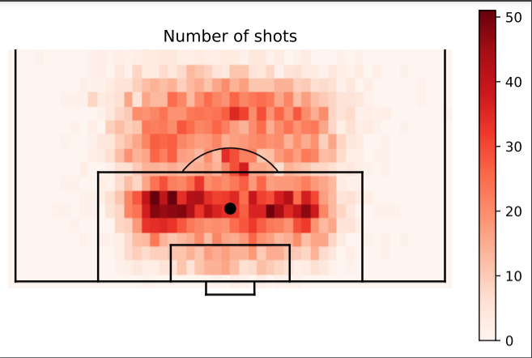
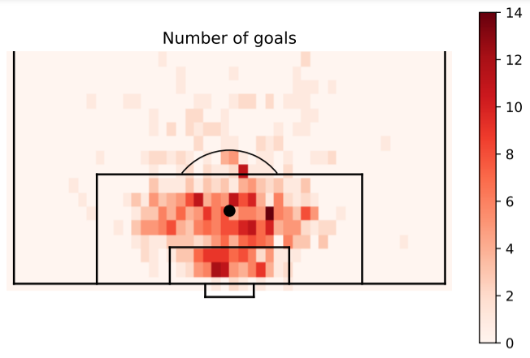
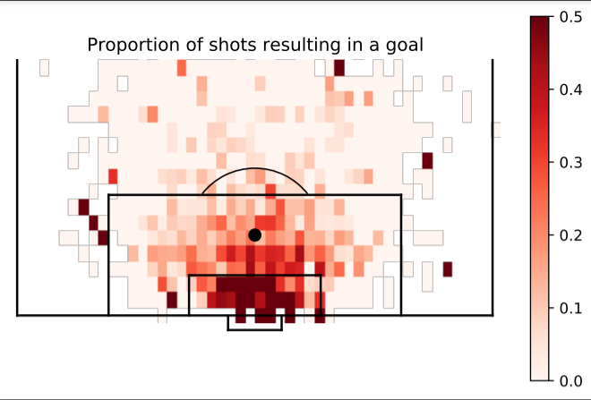
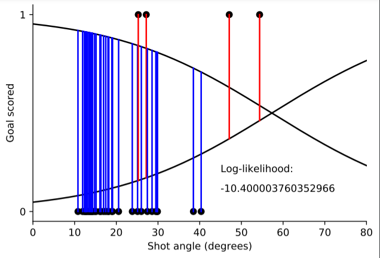
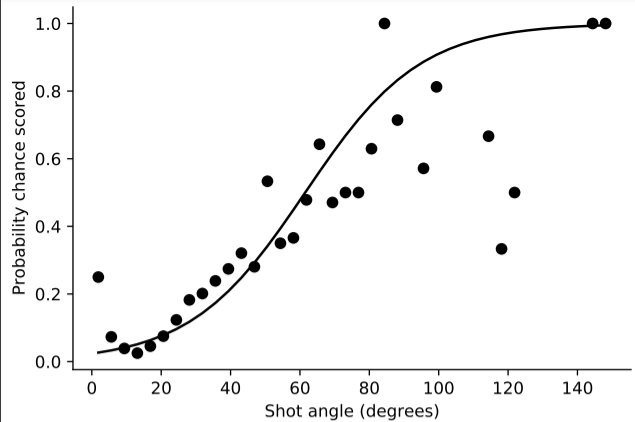
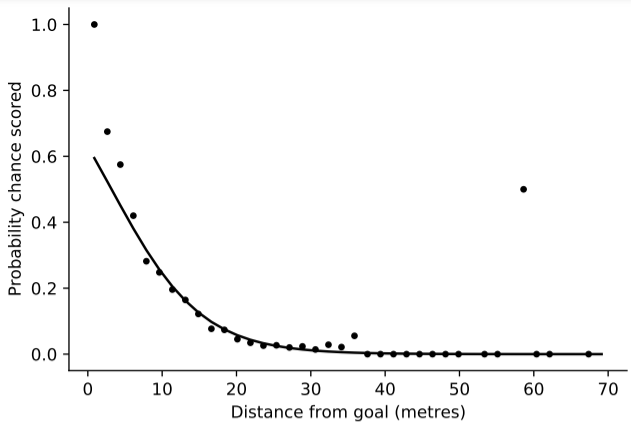
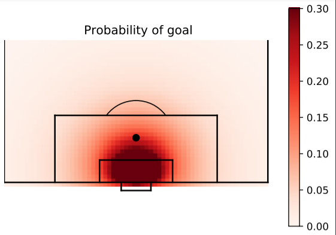
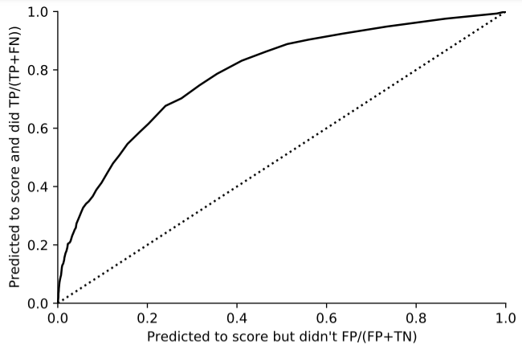

# Expected-Goals-Model

## Project Overview
Diving into the world of football analytics and prediction , the very first measure I got to know about the Expected Goals or xG measure. Thus I had extreme curiosity to know more about it and make a model of my own.

I learn about this measure during a course from UPPSALA University : https://uppsala.instructure.com/courses/28112/pages/0-getting-started

### What is Expected Goals?
EXPECTED GOALS (XG) MEASURES THE QUALITY OF A SHOT BASED ON SEVERAL VARIABLES SUCH AS ASSIST TYPE, SHOT ANGLE AND DISTANCE FROM GOAL, WHETHER IT WAS A HEADED SHOT AND WHETHER IT WAS DEFINED AS A BIG CHANCE.

ADDING UP A PLAYER OR TEAM’S EXPECTED GOALS CAN GIVE US AN INDICATION OF HOW MANY GOALS A PLAYER OR TEAM SHOULD HAVE SCORED ON AVERAGE, GIVEN THE SHOTS THEY HAVE TAKEN.

### Data Used
I used a small chunk of a large Wyscout data for this model which can be found here : https://figshare.com/collections/Soccer_match_event_dataset/4415000/2  
It contains the data of different tournaments around the world with additional data of players , refrees and teams.
For this model , I used the data for English Premier League. Some of the features the data has are :
1. eventId : every event has a unique ID 
2. matchId
3. playerID 
4. positions : coordinates from where the shot was taken on the field.

### Plotting our data : 

First we created a histrogram showing the number of shots taken from different points on the pitch. 
 
We can see clearly that the frequency of shots taken from inside the penalty area are much more than shots taken from outside the area.

Then I saw the number of goals that were scored from the shots taken.
 

Then to see the probability of scoring from different points on the pitch I made the following graph : 
 
One important observation to make here is that we can see that some of the points on the pitch which are farther away from the goal is shaded very dark telling us that the probability of scoring a goal from that point is very high , which is not true. This is due to the number of shots taken from that point are very less.

Thus to deal with abnormality we try to smoothen our histogram by the following steps  :
We take two parameters for which we can determine the probability of a shot resulting to a goal more accurately:
1. The distance from the goal
2. The angle from which the shot was taken with respect to our goal.

Now considering these two parameters one by one we made a dataset taking the first 200 shots , the result of the shot (goal or not) and the angle from which it was taken.
First we saw the likelihood of our data :
 

Then using General Linear Regression , we fitted our model and found the best parameters (a and b)
 

Now lets look at distance from goal
 

We can see that our model is working pretty good on both the parameters.

A general model for fitting goal probability
We can as many variable as we want like the number of defenders between the player taking the shot and the goal or if it is an open goal or not to make our model more accurate.
For now I have considered only 2 parameters and plotted the histogram : 

 

### Measuring Performance
R2 Score : 0.14  
ROC Curve (Whether the shot was a goal or not)
 

### Conclusion : 
As our model does have a average R2 score we can make improvements in it by many ways like:
1. Using Random Forest Regressor or SVR
2. Taking more parameters.

